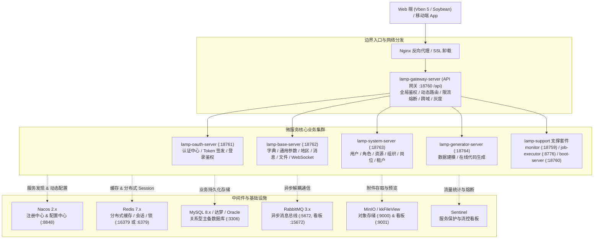

# lamp-cloud 企业级微服务开发基座

<p align="center">
  
  
  
  
  
  
  
  
</p>

本项目基于 **Spring Boot 3.x**、**Spring Cloud 2023** 与 **Spring Cloud Alibaba** 体系构建，致力于提供一套高内聚、低耦合、开箱即用的企业级微服务中后台快速开发基座与多租户 SaaS 解决方案。

---

## 目录

- [平台简介](#平台简介)
- [核心特性](#核心特性)
- [系统架构](#系统架构)
  - [架构示意图](#架构示意图)
  - [网关路由与分发矩阵](#网关路由与分发矩阵)
- [技术选型](#技术选型)
- [模块划分与端口矩阵](#模块划分与端口矩阵)
  - [1. 微服务端口对照表](#1-微服务端口对照表)
  - [2. 标准五层工程架构设计](#2-标准五层工程架构设计)
- [环境依赖](#环境依赖)
- [快速开始](#快速开始)
  - [1. 编译基础依赖 lamp-util](#1-编译基础依赖-lamp-util)
  - [2. 中间件一键拉起](#2-中间件一键拉起)
  - [3. 数据库与 Nacos 配置初始化](#3-数据库与-nacos-配置初始化)
  - [4. 工程打包编译](#4-工程打包编译)
  - [5. 微服务启动与推荐顺序](#5-微服务启动与推荐顺序)
  - [6. 服务验证与默认访问信息](#6-服务验证与默认访问信息)
- [多数据库方言与信创支持](#多数据库方言与信创支持)
- [生产运维与高可用](#生产运维与高可用)
- [常见问题与排错指南 (FAQ)](#常见问题与排错指南-faq)
- [工程文档中心导航](#工程文档中心导航)
- [开源协议与鸣谢](#开源协议与鸣谢)

---

## 平台简介

`lamp-cloud` 专注于解决企业数字化转型与大型中后台系统的架构底座难题，具备成熟完善的**多租户体系**设计，支持从简单的单体化无租户模式平滑过渡到复杂的字段级隔离与独立多库隔离。

平台不仅集成了统一网关路由、基于 **Sa-Token** 的细粒度权限鉴权、动态行级/列级数据权限过滤、分布式缓存与幂等防重，还提供了覆盖前后端全栈的可视化代码生成工具（全面兼容 **Vben 5**、**Soybean Admin** 等主流前端体系），能够大幅缩减业务 CRUD 模块开发周期，确保团队代码风格的高度一致性。

---

## 核心特性

### 1. 现代化微服务体系
- 全面适配 **Java 17 / 21** LTS 长期支持版本，基于 **Spring Boot 3.x** 与 **Spring Cloud 2023** 架构。
- 基于 **Spring Cloud Alibaba** 体系，无缝集成 **Nacos**（服务注册与动态配置中心）、**Sentinel**（高并发流量防护与熔断降级）、**Seata**（分布式事务协调）。

### 2. 灵活的多租户隔离架构
- **无租户模式（NONE）**：针对独立部署、私有化单企业交付场景，架构清晰无冗余。
- **字段级隔离（COLUMN）**：共享数据库实例与表结构，通过租户 ID（`tenant_id`）实现行级数据自动隔离，资源利用率高。
- **数据源隔离（SCHEMA）**：每个租户拥有独立 Schema/数据库实例，满足对数据安全性、合规性要求极高的大型客户需求。

### 3. 统一认证鉴权与细粒度权限（Sa-Token）
- 采用轻量高性能的安全框架 **Sa-Token**，与 API 网关紧密配合，实现全局无状态 Token 校验。
- 标准 **RBAC** 权限模型：支持“用户 - 角色 - 资源（菜单、按钮、数据接口）”多对多分配。
- 支持单点登录（SSO）、多终端并发控制、账号互斥挤下线、黑白名单控制与密码安全策略。

### 4. 动态行级/列级数据权限（lamp-data-scope-sdk）
- 内置数据权限过滤引擎，通过注解与 AOP 自动解析当前登录人的组织架构范围。
- 支持多种数据范围规则：**全部数据**、**本级机构**、**本级及所有下级机构**、**仅限本人**以及**自定义组织部门**，在 MyBatis-Plus 底层动态拦截并自动拼接 SQL `WHERE` 条件，对业务代码无侵入。

### 5. 全栈可视化代码生成（lamp-generator）
- 支持从 MySQL、达梦等数据表中快速逆向导入表结构与元数据信息。
- 一键生成包含 Entity、DTO、VO、Mapper、Service、Controller、OpenFeign Facade 及菜单 SQL 的后端完整五层代码。
- 前端模板深度适配主流管理系统框架：支持 **Vben 5**（Ant Design Vue 4 + Vite）、**Soybean Admin**、经典 Vue 3 等多种模板。

### 6. 自动化关联回显与字典回填（lamp-echo-starter）
- 提供基于注解的自动翻译回显能力（`Echo` 机制），无需编写繁杂的连表 SQL（JOIN）。
- 仅需在 VO/DTO 字段上标注相应注解，接口序列化前即可自动并行批量加载字典文本、用户姓名、机构名称等关联属性，兼具极高开发效率与优异性能。

### 7. 统一对象存储与在线文件预览（lamp-file-sdk）
- 提供跨厂商的文件存储抽象，支持 **MinIO**（私有化主流）、**本地磁盘**、**FastDFS** 等多种存储方案的无缝切换。
- 内置集成 **kkFileView** 容器化服务，原生支持 PDF、Word、Excel、PPT、各类图片及压缩包的在线快速预览。

### 8. 多数据库方言开箱即用
- 系统持久层与初始化脚本同时支持主流及信创数据库：**MySQL 8.0 / 5.7**、**达梦数据库 (DM8)**、**Oracle (12c/19c)**、**SQL Server (2016+)**。

---

## 系统架构

### 架构示意图



### 网关路由与分发矩阵

网关统一监听端口为 `18760`，上下文根路径为 `/api`，下发路由通过 `StripPrefix=1` 自动剥离模块前缀后转发至各微服务：

| 外部请求路径 | 转发微服务 (`lb://`) | 剥离前缀 | 承载核心业务 |
| :--- | :--- | :---: | :--- |
| `/api/oauth/**` | `lamp-oauth-server` | 1 | 认证授权、Token 签发、刷新 Token、验证码、用户信息 |
| `/api/system/**` | `lamp-system-server` | 1 | 系统管理（用户、角色、资源菜单、组织机构、租户数据） |
| `/api/base/**` | `lamp-base-server` | 1 | 基础数据（通用字典、系统参数、行政区划、站内信、文件存取） |
| `/api/wsMsg/**` | `ws://lamp-base-server` | 1 | WebSocket 双工长连接实时通知与消息广播 |
| `/api/generator/**` | `lamp-generator-server` | 1 | 可视化代码生成、表结构逆向元数据管理、代码包下载 |

> [!TIP]
> 更多架构设计图、依赖关系图与监控拓扑，请参阅目录：[`doc/image/架构图/`](doc/image/架构图/)。

---

## 技术选型

| 维度 | 关键技术 | 选型说明与版本 |
| :--- | :--- | :--- |
| **基础语言与环境** | **Java** | 推荐使用 JDK 17 LTS 或 JDK 21 LTS |
| **构建管理** | **Maven** | Maven 3.8+ / 3.9+ |
| **基础核心框架** | **Spring Boot** | 3.2.x 核心底座 |
| **微服务治理套件** | **Spring Cloud** | 2023.x (Spring Cloud Alibaba 2023.x) |
| **微服务注册与配置** | **Nacos** | 2.x+ 注册中心与集中配置管控 |
| **服务网关** | **Spring Cloud Gateway** | 响应式 Reactive API 路由与全局过滤器 |
| **服务通信** | **OpenFeign** | 声明式 HTTP 服务间客户端远程调用 |
| **安全与认证鉴权** | **Sa-Token** | 1.45+ 轻量级安全框架（网关路由鉴权、Session、踢人） |
| **持久层 ORM** | **MyBatis-Plus** | 3.5.x+ 丰富 CRUD 增强与多租户/数据权限拦截器插件 |
| **数据库连接池** | **HikariCP / Druid** | 高性能企业级数据库连接池 |
| **分布式缓存** | **Redis** | 6.x / 7.x 分布式缓存、Token 与热点数据管理 |
| **分布式消息队列** | **RabbitMQ** | 3.12+ 异步事件通信、数据同步与削峰填谷 |
| **分布式事务** | **Seata** | 2.x AT 模式无侵入分布式事务协同 |
| **服务熔断与限流** | **Sentinel** | 流量防卫兵、实时监控看板与集群降级 |
| **API 文档与契约** | **SpringDoc** | 2.3.x (OpenAPI 3 / Knife4j) 接口文档看板 |
| **对象存储** | **MinIO / FastDFS** | 高性能云原生 S3 兼容对象存储 |
| **文件在线预览** | **kkFileView** | 支持 Office、PDF、图片等多格式在线渲染预览 |
| **分布式任务调度** | **XXL-JOB** | 分布式定时任务调度平台（支持集群执行） |
| **前端推荐方案** | **Vben 5 / Soybean** | Vue 3 + TypeScript + Vite + Ant Design Vue / Naive UI |

---

## 模块划分与端口矩阵

### 1. 微服务端口对照表

| 模块名称 | 默认端口 | 上下文路径 / 路由前缀 | 职责定位与核心说明 |
| :--- | :--- | :--- | :--- |
| **`lamp-dependencies-parent`** | - | - | 全局统一依赖与第三方库版本管理 POM |
| **`lamp-public`** | - | - | 公共模型、通用 SDK 集合与底层核心基类（模型/安全/回显/数据权限） |
| **`lamp-gateway-server`** | `18760` | `/api` | 统一 API 微服务网关，流量接收、路由转发、全局鉴权与灰度控制 |
| **`lamp-oauth-server`** | `18761` | `/api/oauth` | 认证授权中心，多方式登录鉴权、Token 签发与刷新 |
| **`lamp-base-server`** | `18762` | `/api/base`, `/api/wsMsg` | 基础业务服务，字典/参数/文件存储/站内消息/WebSocket 实时通道 |
| **`lamp-system-server`** | `18763` | `/api/system` | 核心系统服务，用户/角色/资源菜单/组织机构/岗位/租户管理 |
| **`lamp-generator-server`** | `18764` | `/api/generator` | 在线可视化代码生成服务，多前端模板支持 |
| **`lamp-monitor`** | `18759` | `/lamp-monitor` | Spring Boot Admin 微服务健康度大屏与运行指标监控 |
| **`lamp-job-executor`** | `8776` | - | XXL-JOB 任务调度执行器（RPC 通信端口 `8777`） |
| **`lamp-boot-server`** | `18760` | - | 聚合单体模式服务（开发环境 `18760`，生产环境 `28760`） |

### 2. 标准五层工程架构设计

每个独立业务微服务（如 `lamp-system`、`lamp-base`、`lamp-oauth`）均严格遵循标准化高内聚设计规范，解耦为 5 个子工程：

```text
lamp-[module]
├── lamp-[module]-entity       # 基础实体层：包含 Entity、DTO、VO、入参校验规则与枚举
├── lamp-[module]-biz          # 核心业务层：DAO/Mapper、Service 业务逻辑实现、缓存与数据权限处理
├── lamp-[module]-controller   # 接口暴露层：RESTful 控制器、Swagger/OpenAPI 描述与参数转换
├── lamp-[module]-facade       # 服务间契约：OpenFeign 客户端声明、传输模型与 Fallback 熔断降级
└── lamp-[module]-server       # 独立可运行服务：Spring Boot 启动类、环境配置文件与 Dockerfile
```

---

## 环境依赖

在开始本地构建与部署前，请确保您的工作机或服务器已安装并配置好以下基础软件：

- **JDK**：`17+` 或 `21+`（推荐 Eclipse Temurin、Alibaba Dragonwell 或 Oracle OpenJDK）
- **Maven**：`3.8.0+`（配置国内镜像源如阿里云以获得更流畅的拉取速度）
- **MySQL**：`8.0+`（亦可选择 5.7 或达梦 DM8、Oracle、SQL Server）
- **Redis**：`6.0+` 或 `7.0+`
- **Nacos**：`2.2+`（推荐使用 `2.3.x` 并开启鉴权）
- **Docker & Docker Compose**（推荐）：`Docker 24.0+` / `Compose 2.20+`
- **Node.js**（仅运行前端工程时需要）：`18.x+` / `20.x+` 与 `pnpm`

---

## 快速开始

### 1. 编译基础依赖 lamp-util

> [!IMPORTANT]
> `lamp-cloud` 依赖统一底层公共工具库 **`lamp-util`**（版本为 `5.10.0`）。  
> 若您是初次获取源码，必须**首先编译并安装 `lamp-util` 到本地 Maven 仓库**：

```bash
# 进入 lamp-util 源码目录并执行安装
cd /path/to/lamp-util
mvn clean install -DskipTests
```

---

### 2. 中间件一键拉起

推荐直接使用项目提供的 Docker Compose 快速初始化本地/测试环境的基础中间件（包含 MySQL 8、Redis 7、Nacos 2.x、RabbitMQ 3 与 MinIO）：

```bash
cd doc/dockerfile

# 1. 复制环境变量模板文件
cp .env.example .env

# 2. 按需修改 .env 中的密码与端口（若使用默认值可跳过）

# 3. 后台一键拉起所有依赖容器
docker compose up -d
```

> [!TIP]
> 容器就绪后，可通过 `docker compose ps` 查看各组件运行状态。

---

### 3. 数据库与 Nacos 配置初始化

#### 3.1 导入数据库初始化脚本
参考 [`doc/sql/注意.md`](doc/sql/注意.md) 导入对应数据库方言的脚本（以 MySQL 8.0 为例）：

1. **创建基础库**：在 MySQL 客户端中优先执行 [`doc/sql/mysql/1.先执行我,创建数据库.sql`](doc/sql/mysql/1.先执行我,创建数据库.sql)
   - 创建业务数据库：`lamp_none`
   - 创建 Nacos 配置数据库：`lamp_nacos`
2. **导入核心业务表**：连接至新建的 `lamp_none` 数据库，完整执行业务表结构及基础数据脚本 [`doc/sql/mysql/lamp_none.sql`](doc/sql/mysql/lamp_none.sql)。

#### 3.2 导入 Nacos 微服务配置包
1. 访问 Nacos 控制台（本地默认地址：`http://127.0.0.1:8848/nacos`，初始账号/密码：`nacos / nacos`）。
2. 在“配置管理” -> “配置列表”页面，点击“导入配置”按钮。
3. 上传导入预置压缩包：[`doc/third-party/nacos/nacos_config_export_20260615232624.zip`](doc/third-party/nacos/nacos_config_export_20260615232624.zip)。
4. **关键配置校对**：
   - 检查公共配置文件 `common.yml`、`mysql.yml`、`redis.yml`、`rabbitmq.yml`。
   - 确认数据库连接 IP、端口与密码。
   - **注意 Redis 端口**：Nacos 导出的默认预设配置中 `redis.yml` 端口为 `16379`（密码 `SbtyMveYNfLzTks7H0apCmyStPzWJqjy`）。若本地 Redis 运行在标准端口 `6379` 且无密码，请在 Nacos 的 `redis.yml` 中修改为对应端口与密码。

---

### 4. 工程打包编译

在项目根目录下执行全量 Maven 编译打包命令：

```bash
# 清理并完成所有子工程构建与 JAR 打包
mvn clean package -DskipTests
```

构建成功后，各个 `*-server` 模块下的 `target/` 目录将分别生成对应的微服务可执行 JAR 包。

---

### 5. 微服务启动与推荐顺序

微服务之间存在上下文依赖与网关路由探测，**推荐严格按照以下顺序启动**：

```text
[Step 1] lamp-gateway-server    (统一 API 网关，端口 18760，接收并路由前端流量)
   ↓
[Step 2] lamp-oauth-server      (认证授权中心，端口 18761，Token 签发与权限校验)
   ↓
[Step 3] lamp-base-server       (基础数据服务，端口 18762，数据字典、文件存取与消息)
   ↓
[Step 4] lamp-system-server     (系统管理核心，端口 18763，用户、角色、租户与机构)
   ↓
[Step 5] lamp-generator-server  (代码生成器服务，端口 18764，按需启动)
   ↓
[Step 6] lamp-monitor           (Spring Boot Admin 监控大屏，端口 18759，可选)
```

#### 启动方式选择：
- **方式 A：IDE 本地调试**  
  在 IntelliJ IDEA 或 VSCode 中，按上述顺序分别运行各模块的主启动类（`*Application.java`）。
- **方式 B：Shell 脚本批量启动（Linux）**  
  使用项目提供的运维脚本体系一键拉起：
  ```bash
  sh doc/shells/linux/start-all.sh dev
  ```
- **方式 C：Windows 批处理脚本**  
  使用 [`doc/shells/window/`](doc/shells/window/) 目录下的批处理脚本。
- **方式 D：Docker 容器化部署**  
  各微服务均内置标准 Dockerfile，可参阅 [`doc/docker/03.docker运行项目.md`](doc/docker/03.docker运行项目.md) 进行镜像构建与容器运行。

---

### 6. 服务验证与默认访问信息

启动完毕后，在浏览器中访问相应端点进行系统连通性验证：

| 服务/组件 | 访问地址 | 默认账号 / 密码 / 凭证 | 备注说明 |
| :--- | :--- | :--- | :--- |
| **API 统一网关** | `http://127.0.0.1:18760/api` | - | 客户端/前端请求统一入口地址 |
| **OpenAPI / 接口文档** | `http://127.0.0.1:18760/api/doc.html` | - | 基于 SpringDoc 聚合的微服务 Knife4j API 契约看板 |
| **Nacos 控制台** | `http://127.0.0.1:8848/nacos` | `nacos / nacos` | 服务列表中各服务需显示为健康状态（`UP`） |
| **服务监控中心** | `http://127.0.0.1:18759/lamp-monitor` | - | Spring Boot Admin 微服务集群健康监控大屏 |
| **RabbitMQ 控制台** | `http://127.0.0.1:15672` | `admin / admin123` *(或 lamp/lamp)* | 消息队列运行状态与队列监控 |
| **MinIO 对象存储看板** | `http://127.0.0.1:9001` | `minioadmin / minioadmin` *(或 lamp/lamp123456)* | 附件云存储桶与文件管理后台 |
| **系统内置超级管理员** | 业务前端登录界面 | `admin / 123456` | 拥有平台最高管理权限，**生产环境务必第一时间修改** |

> [!NOTE]
> **API 调试全局请求头（Header）规范**：
> - `Token`: 登录成功后换取的业务身份凭证（由 Sa-Token 管理并透传）。
> - `Authorization`: 客户端凭证（默认格式为 Basic Auth，预设值为 `Basic bGFtcF93ZWI6bGFtcF93ZWJfc2VjcmV0`）。
> - `ApplicationId`: 当前应用标识（默认填 `1`）。

---

## 多数据库方言与信创支持

`lamp-cloud` 原生设计具备优异的数据库多方言兼容能力，SQL 编写与分页插件均严格适配各厂商特性：

| 数据库 | 版本要求 | 驱动与依赖配置 | 预置脚本路径 |
| :--- | :--- | :--- | :--- |
| **MySQL** | `8.0+` / `5.7` | `com.mysql.cj.jdbc.Driver` | [`doc/sql/mysql/`](doc/sql/mysql/) |
| **达梦 (DM8)** | `DM8` (信创推荐) | `dm.jdbc.driver.DmDriver` | [`doc/sql/dameng/`](doc/sql/dameng/) |
| **Oracle** | `12c+` / `19c` | `oracle.jdbc.OracleDriver` | [`doc/sql/oracle/`](doc/sql/oracle/) |
| **SQL Server** | `2016+` | `com.microsoft.sqlserver.jdbc.SQLServerDriver` | [`doc/sql/sqlserver/`](doc/sql/sqlserver/) |

> [!TIP]
> 切换至其他数据库方言时，只需在 Nacos 控制台的 `mysql.yml`（或对应数据源配置文件）中调整 JDBC URL 与驱动类名，并从 `doc/sql/` 对应子目录下导入初始化 SQL 即可。

---

## 生产运维与高可用

### 1. JVM 生产推荐调优参数
针对核心业务容器与裸机实例，推荐采用现代化 **G1GC** 垃圾回收器，基线参数参考如下：

```bash
-server -Xms2048m -Xmx4096m -Xss512k -XX:MetaspaceSize=256M -XX:MaxMetaspaceSize=512M \
-XX:+UseG1GC -XX:MaxGCPauseMillis=200 -XX:+HeapDumpOnOutOfMemoryError \
-XX:HeapDumpPath=/data/logs/dump.hprof -Dfile.encoding=UTF-8
```

### 2. 优雅停机与进程治理
通过标准运维脚本 [`doc/shells/linux/run.sh`](doc/shells/linux/run.sh)，系统支持微服务生产环境的安全优雅注销：
```bash
# 语法: sh run.sh {start|stop|restart|status} <服务名> [Profile]
sh run.sh restart lamp-system-server prod
```
脚本内置循环状态探测机制（`kill -15` 优雅通知 -> 等待请求处理完成 -> 超时强制 `kill -9` 兜底），确保正在执行中的业务事务不受中断。

### 3. 限流与容错机制
关于微服务调用链超时计算（`Gateway -> Feign -> Sentinel`）及线程池隔离、降级配置的深度解析，请深入阅读 [`doc/hystrix配置详解.md`](doc/hystrix配置详解.md)。

---

## 常见问题与排错指南 (FAQ)

<details>
<summary><b>Q1: 为什么执行 <code>mvn clean compile</code> 时提示 <code>lamp-util</code> 依赖不存在？</b></summary>

> `lamp-cloud` 深度依赖基础类库 `com.dalio.basic:lamp-util:5.10.0`。若第一次下载源码，必须先在本地检出 `lamp-util` 项目并执行 `mvn clean install -DskipTests` 将其发布至本地 Maven 仓库，然后再构建本工程。
</details>

<details>
<summary><b>Q2: 为什么微服务启动时报错连接不上 Redis？</b></summary>

> 检查 Nacos 中的 `redis.yml` 配置文件。Nacos 导出的默认配置端口为 `16379`，若您的 Redis 运行在 `6379` 或没有密码，请在 Nacos 的 `redis.yml` 中将 `port` 和 `password` 修改为您本地实际参数，点击发布即可热更新生效。
</details>

<details>
<summary><b>Q3: 为什么访问 <code>http://127.0.0.1:18760/doc.html</code> 提示 404？</b></summary>

> 网关设置了全局上下文路径 `server.servlet.context-path: /api`。因此所有网关接口均需携带 `/api` 前缀，接口文档请访问：`http://127.0.0.1:18760/api/doc.html`。
</details>

<details>
<summary><b>Q4: 为什么前端调用接口返回客户端鉴权异常（JWT_BASIC_INVALID）？</b></summary>

> 请求未携带正确的 `Authorization` 请求头。系统默认客户端凭证为 Basic Auth 格式：`Basic bGFtcF93ZWI6bGFtcF93ZWJfc2VjcmV0`（表示 `lamp_web:lamp_web_secret` 的 Base64 编码）。
</details>

---

## 工程文档中心导航

项目 `doc/` 目录下汇集了系统详尽的运维脚本、初始化脚本及各维度最佳实践手册：

```text
doc/
├── README.md                          # 运维与工程文档中心总览与索引导航
├── sql/                               # 多数据库方言初始化脚本
│   ├── mysql/                         # MySQL 8.0 / 5.7 建库与业务表结构
│   ├── dameng/                        # 达梦数据库 (DM8) 初始化脚本
│   ├── oracle/                        # Oracle 12c+ 用户创建与授权脚本
│   ├── sqlserver/                     # SQL Server 初始化脚本
│   └── 注意.md                        # 数据库初始化操作规范与注意事项
├── docker/                            # Docker 容器化运维专题指南
│   ├── 01.环境初始化(可选).md          # Linux 宿主机基础配置调优
│   ├── 02.docker安装.md               # 现代化 Docker CE 与 Compose 官方安装指引
│   └── 03.docker运行项目.md           # 微服务打包、镜像构建与容器运行全流程
├── dockerfile/                        # 中间件容器化配置文件与编排
│   ├── docker-compose.yml             # 基础中间件一键编排 (MySQL, Redis, Nacos, RabbitMQ, MinIO)
│   ├── .env.example                   # 环境变量配置模板
│   ├── nacos/ & redis/ & rabbitmq/    # 各基础中间件专用配置与容器启动脚本
│   └── MinIo/ & nginx/ & xxFileView/  # 对象存储、反向代理与在线文件预览配置
├── shells/                            # 本地与服务器启停运维脚本
│   ├── linux/                         # Linux 环境 Shell 启停脚本 (run.sh, start-all.sh 等)
│   └── window/                        # Windows 本地快速调试批处理脚本 (*.bat)
├── third-party/                       # 第三方中间件预置数据 (Nacos 配置导出包)
├── image/                             # 系统架构图、依赖图与监控拓扑
└── hystrix配置详解.md                  # 微服务超时联动计算与容错熔断调优手册
```

- 数据库使用注意事项：[`doc/sql/注意.md`](doc/sql/注意.md)
- Docker 完整部署手册：[`doc/docker/03.docker运行项目.md`](doc/docker/03.docker运行项目.md)
- 中间件编排指南：[`doc/dockerfile/docker-compose.yml`](doc/dockerfile/docker-compose.yml)
- 运维启停脚本体系：[`doc/shells/linux/run.sh`](doc/shells/linux/run.sh)
- 熔断降级与超时配置：[`doc/hystrix配置详解.md`](doc/hystrix配置详解.md)

---

## 开源协议与鸣谢

- 本项目基于开源项目 [lamp-cloud](https://github.com/dromara/lamp-cloud) 进行深入定制与二次改造。
- 代码遵循 [Apache-2.0](LICENSE) 开源许可证，并附带 [NOTICE](NOTICE) 归属说明。
- 感谢 **Spring Cloud**、**Alibaba Cloud**、**Sa-Token**、**MyBatis-Plus** 等开源社区提供的优秀基础设施！
